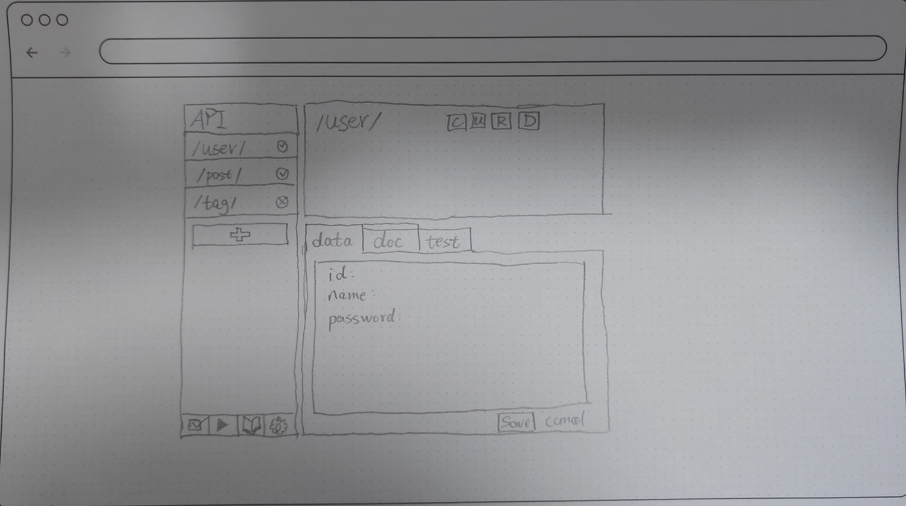

Monkey Mocky
========

Monkey Mocky is a mock server, a document generator, and a test runner, mainly
built to help FE developers to do their job efficiently

默契猴（Monkey Mocky）整合了模拟数据服务、文档生成、测试执行器三种功能。
希望能让前端开发者的工作更有效率。

安装
--------

```bash
$ npm i @meathill/mocky -g
$ mmocky -v
Monkey Mocky v1.0.0
```

使用
--------

Mocky 面向开发者，所以基于项目管理的功能都在命令行进行。不过 Mocky
也有图形界面，主要方便我们配置 API 和运行测试。未来，会有全功能的 UI 和
全功能的命令行界面，方便用户择优选择。

首先，创建一个目录。每个项目的数据会放在各自的目录里，分别管理。你可以提交目录
到自己的 git 仓库，保存服务器配置、测试用例等。但不建议修改目录里的文件，因为
大部分文件均为自动生成，下一次生成可能会覆盖掉你的修改。

接下来，进入目录，启动 Mocky：

```bash
$ mmocky --start --host localhost --port 8080
Mocky is running on http://localhost:8080
```

然后，在浏览器里打开 http://localhost:8080（注意，根据参数和配置的不同，
URL 可能存在变化，请自行修改）。你应该能看到如下界面：



接下来，你可以创建 API，设定对应的请求和返回。

### CURD

Mocky 提供了一个简单的功能创建 CURD 接口。你只需要设置前缀，比如 `/user/`，
然后选中 CRUD，接下来填写属性字段，包含 `GET /users/`、`PUT /users/:id` 的
接口都会自动创建好。

### 使用 API

Mocky 会自动启动服务，使用同样的域名/IP 和端口，按照上例，即 `http://localhost:8080/api`，
你可以在自己的项目中配置使用这个 API。

### 生成文档

配置好 API 之后，只需要点击左下角的生成按钮，就可以对所有接口生成文档。
生成的文档，位于目录的 `/docs` 下面，默认是不提交到仓库的。

### 运行测试

同样，点击“运行测试”按钮，就会启动测试。测试由 Mocky 服务器执行，
只要程序不中断，就会持续运行，直到所有接口都得到测试（CURD 接口的每个方法
都会测试）。测试报告会放在 `/test-reports` 目录下面，从界面上可以看到
测试简报。


开发
--------

```bash
git clone git@github.com:meathill/monkey-mocky.git
cd monkey-mock
npm i
npm link
```
